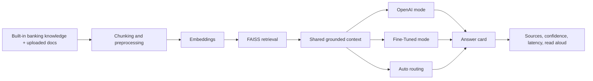
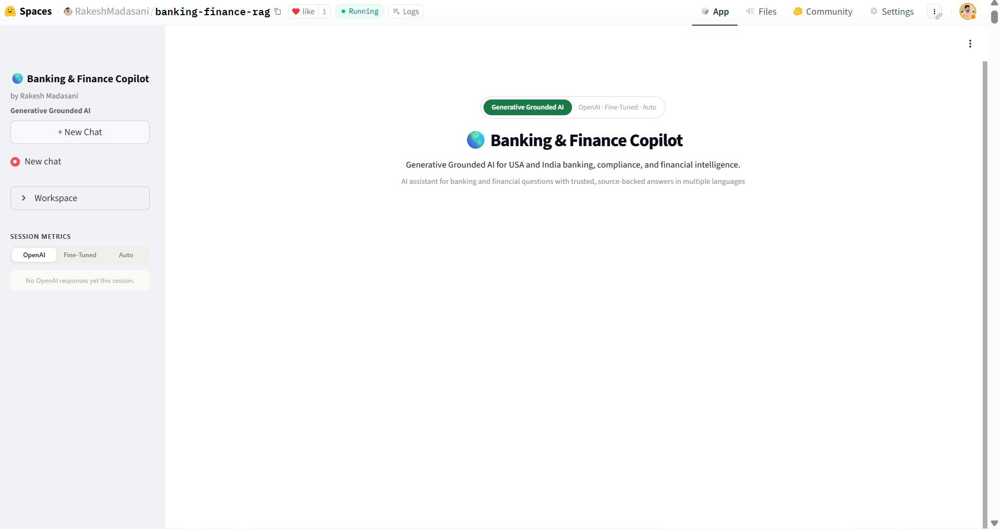
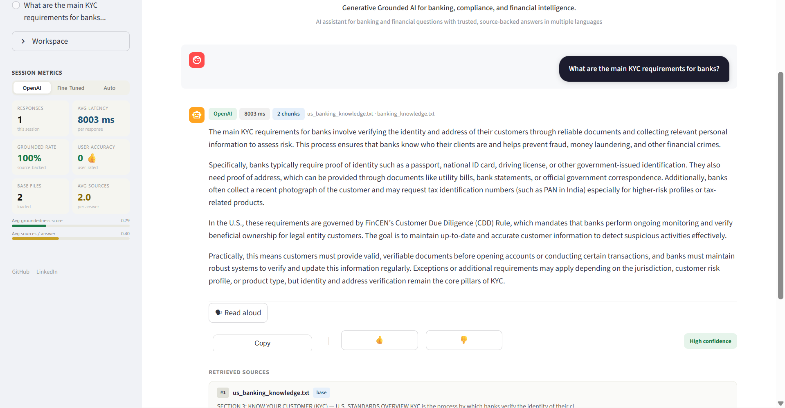
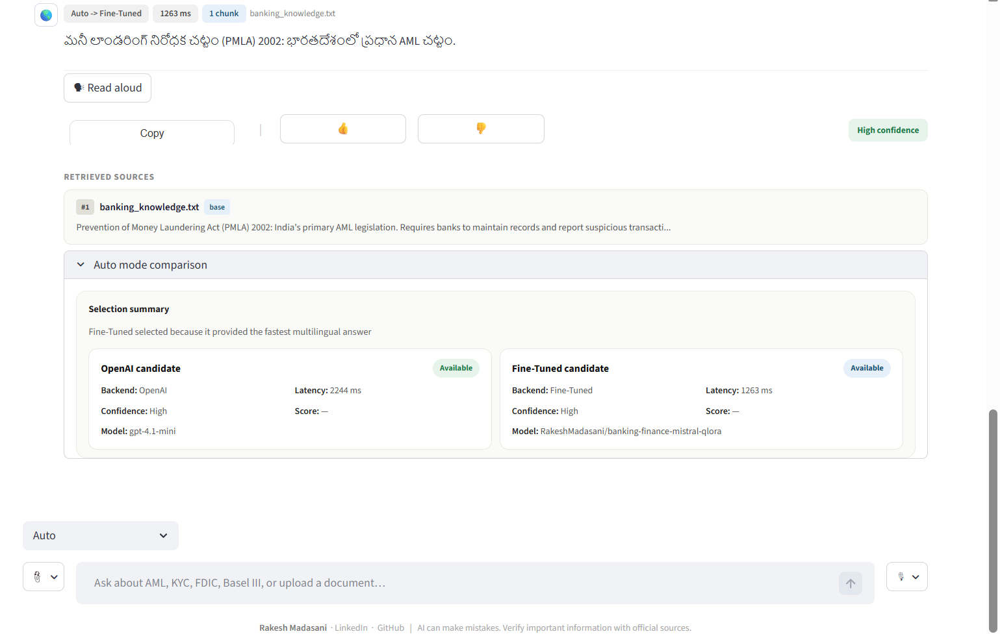

# Banking & Finance Copilot

Banking & Finance Copilot is a grounded AI product for USA and India banking, compliance, and financial intelligence. It combines retrieval over curated banking material with multiple model paths, source-backed answer cards, uploads, multilingual support, and evaluation workflows that are committed in the repo alongside the app itself.

## Live Product

[banking-finance-rag on Hugging Face](https://huggingface.co/spaces/RakeshMadasani/banking-finance-rag)

## What This Project Is

This is the product layer of the broader portfolio. The goal was not just to make a banking chatbot answer questions. The goal was to make it behave like a product someone could open, test, trust, and discuss seriously:

- grounded answers instead of free-floating generation
- visible source support
- multiple model modes with clear routing behavior
- uploads for real user documents
- multilingual interaction
- reproducible evaluation, not just screenshots

## What The User Can Do

- ask banking, AML, KYC, FDIC, Basel III, RBI, and compliance questions
- switch between `OpenAI`, `Fine-Tuned`, and `Auto` modes
- upload PDF, DOCX, TXT, and image files
- inspect retrieved sources under each answer
- use read-aloud on the final response
- test multilingual questions

## Why The Product Is Structured This Way

Trust was the main design constraint. For finance and compliance questions, a polished answer alone is not enough. The product needs to show where the answer came from and make its behavior explainable.

That is why the app is built around:

- shared retrieval before generation
- source cards and chunk previews
- model-mode transparency
- latency and confidence visibility
- evaluation packs committed in the repository

## Model Modes

### OpenAI

This is the strongest general-purpose answer path and the most stable baseline for live testing.

### Fine-Tuned

This uses the banking-domain Mistral adapter. It is valuable when the hosted path is configured and when lower-latency or domain-style responses are desirable.

### Auto

Auto retrieves once, evaluates candidate answer paths, and selects the winner. That makes the routing logic easier to reason about than a hidden black-box switch.

## Product Architecture



## How It Works

1. The app loads curated banking knowledge files and any uploaded user documents.
2. Documents are chunked and embedded.
3. FAISS retrieves the most relevant context for the question.
4. The selected model mode answers from that shared context.
5. The UI renders the answer together with:
   - mode
   - latency
   - chunk count
   - source cards
   - confidence label

## Product Walkthrough

### Home screen

This is the first impression of the product: the Banking & Finance Copilot shell, the sidebar, and the live model controls.



### English grounded answer

This example shows how the product answers an English banking question with a direct explanation, source cards, and visible latency.



### Telugu grounded answer

This example shows the same answer format working for a Telugu banking question while keeping the evidence visible.


### Auto routing comparison

This view shows Auto mode comparing available answer paths and choosing the faster route while keeping the reasoning visible.



## Evaluation

The [`evaluation`](./evaluation) folder now includes two larger committed evaluation packs:

- `evaluation_queries.md`
  120 domain-specific prompts across OpenAI, Fine-Tuned, and Auto
- `evaluation_multilingual.md`
  120 multilingual prompts across the same three modes

Supporting scripts:

- `run_eval_sets.py`
- `summarize_eval_sets.py`

Latest committed result snapshots live in [`evaluation/results`](./evaluation/results).

### Latest committed summaries

| Evaluation set | Total prompts | Available evaluated rows | Average latency | Median latency |
|---|---:|---:|---:|---:|
| Domain set | 120 | 80 | 2037.0 ms | 2036.0 ms |
| Multilingual set | 120 | 80 | 2031.8 ms | 2031.5 ms |

## Run Locally

### Prerequisites

- Python 3.10+
- OpenAI API key

### Install

```bash
pip install -r requirements.txt
```

### Environment

```bash
OPENAI_API_KEY=your_api_key_here
OPENAI_MODEL=gpt-4o-mini
OPENAI_STT_MODEL=gpt-4o-mini-transcribe
OPENAI_TTS_MODEL=gpt-4o-mini-tts
OPENAI_TTS_VOICE=alloy
FINETUNED_MODEL_ID=RakeshMadasani/banking-finance-mistral-qlora
FINETUNED_ENDPOINT_URL=
HF_TOKEN=your_hugging_face_token
```

### Start the app

```bash
streamlit run app.py
```

## Notes

- Fine-Tuned mode depends on a configured hosted endpoint to reflect full production behavior.
- Voice input and some upload flows are still environment-sensitive because they depend on browser/runtime behavior.
- The app is built for groundedness and explainability first, not raw throughput.
