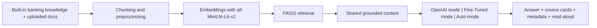

# ?? Banking & Finance Copilot

Banking & Finance Copilot is a grounded AI assistant for banking and financial knowledge. It combines retrieval over curated banking material with multiple model modes, document upload support, accessibility controls, and transparent source cards so the product feels trustworthy in live demos and portfolio reviews.

## Hugging Face Demo Link
[banking-finance-rag](https://huggingface.co/spaces/RakeshMadasani/banking-finance-rag)

## Project Overview

This project upgrades a banking RAG assistant into a more product-like copilot experience. It preserves the core grounding value of the original assistant while improving explainability, UI clarity, upload workflows, model orchestration, and accessibility.

## Why This Project Matters

Most AI demos answer questions. Fewer show why the answer should be trusted. This project is designed around that trust layer:

- shared retrieval before generation
- visible source cards and chunk previews
- fallback behavior when support is weak
- explicit model-mode selection
- honest labeling for partial preview features

## Core Features

- OpenAI mode as the strongest stable baseline
- Fine-Tuned mode for a custom banking-domain model path
- Auto mode that retrieves once, scores candidates, and chooses the stronger response
- PDF, DOCX, and TXT upload support for session retrieval
- Image Upload (Preview) with clear non-multimodal labeling
- Voice Input (Preview) with browser recording and transcription
- Read Answer Aloud using generated speech for the final assistant answer
- Accessibility controls for large text, high contrast, and simplified response display
- Source-grounded response cards with metadata and chunk rank

## Model Modes

### OpenAI

Uses the strongest current RAG path and is the recommended baseline mode for live demos.

### Fine-Tuned

Uses a banking-domain fine-tuned model path when the backend is configured. This mode is kept honest in the UI and should only be treated as fully production-ready when the hosted model path is verified.

### Auto

Retrieves context once, asks each available model path to answer on the same grounding, and chooses the winner using a simple weighted score:

- groundedness
- completeness
- latency

This keeps the logic explainable in interviews and makes the routing behavior transparent.

## Accessibility Features

- Large text for better readability
- High contrast for stronger visual separation
- Simplified response display for shorter paragraph formatting
- clear section labels and grouped sidebar controls
- source cards separated from the answer for easier scanning

## Architecture



## How It Works

1. The app loads the built-in banking knowledge files and optional uploaded documents.
2. Documents are chunked and embedded with `sentence-transformers/all-MiniLM-L6-v2`.
3. FAISS retrieves the most relevant chunks for the user question.
4. The selected model mode generates a response from the same grounded context.
5. The UI shows:
   - the answer
   - the selected model
   - response time
   - retrieved chunk count
   - source cards with chunk previews
6. If retrieval is weak, the app lowers confidence and asks the user to narrow the question or upload more relevant material.

## How to Run Locally

### Prerequisites

- Python 3.10+
- OpenAI API key

### Install

```bash
pip install -r requirements.txt
```

### Environment

Create a `.env` file or export the variables in your shell:

```bash
OPENAI_API_KEY=your_api_key_here
OPENAI_MODEL=gpt-4o-mini
OPENAI_STT_MODEL=gpt-4o-mini-transcribe
OPENAI_TTS_MODEL=gpt-4o-mini-tts
OPENAI_TTS_VOICE=alloy
FINETUNED_MODEL_ID=RakeshMadasani/banking-finance-mistral-qlora
FINETUNED_ENDPOINT_URL=
HF_TOKEN=your_hugging_face_token
```

### Run

```bash
streamlit run app.py
```

## Screenshots

### Live app overview
This screenshot shows the deployed Space header, product framing, and dashboard metrics in one view.


### Low-latency answer example
Question shown:
`Explain Regulation E liability limits for unauthorized transfers?`


## Evaluation

The repository includes lightweight evaluation support in [`evaluation`](./evaluation) with:

- starter questions for OpenAI, Fine-Tuned, and Auto modes
- notes for comparing groundedness, completeness, latency, and fallback behavior
- room to expand into a stronger benchmark over time

## Current Limitations

- Fine-Tuned mode depends on a configured hosted model path to feel fully production-ready.
- Voice Input is labeled as a preview because browser recording reliability can vary by environment.
- Image Upload is a preview workflow and does not claim full multimodal reasoning.
- The app is optimized for trust and explainability, not high-throughput production traffic.

## Roadmap

- stronger hosted fine-tuned model deployment
- better chunk ranking and citation styling
- richer evaluation tables across all model modes
- optional OCR or image reasoning once a real multimodal backend is wired
- further polish for mobile layout and accessibility
