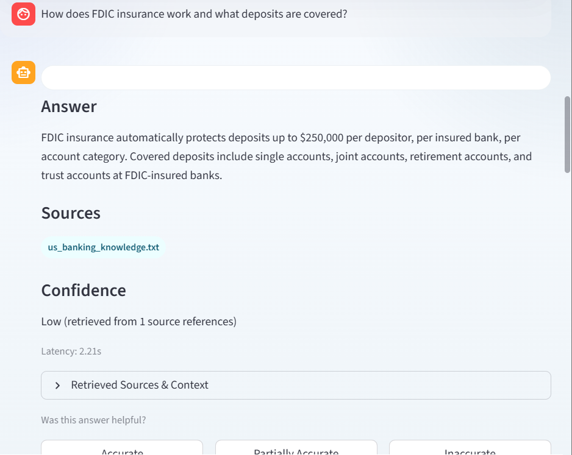

# Banking Finance RAG Assistant

This project is a live Retrieval-Augmented Generation (RAG) assistant for banking, finance, compliance, and regulatory question answering.

## Live Demo
[banking-finance-rag](https://huggingface.co/spaces/RakeshMadasani/banking-finance-rag)

## Screenshots
### Dashboard metrics

### Question-answer example
Question shown:
`How does FDIC insurance work and what deposits are covered?`

## Overview
The assistant retrieves relevant context from a curated domain knowledge base and optional uploaded PDFs, then uses an LLM to generate grounded responses with source visibility.

## Stack
- Streamlit
- LangChain
- OpenAI
- FAISS
- sentence-transformers
- pypdf

## Key Features
- source-grounded banking Q&A
- PDF upload support
- streaming responses
- confidence indicators
- lightweight evaluation metrics

## Note on latency screenshots
The current screenshots in this repository reflect one real app session and are included as product evidence. If you capture a stronger low-latency run later, you can replace the answer screenshot with that newer example without changing the rest of the README structure.

## Focus Areas
- AML
- KYC
- FDIC
- RBI
- Basel III
- SAR / CTR
- banking compliance
