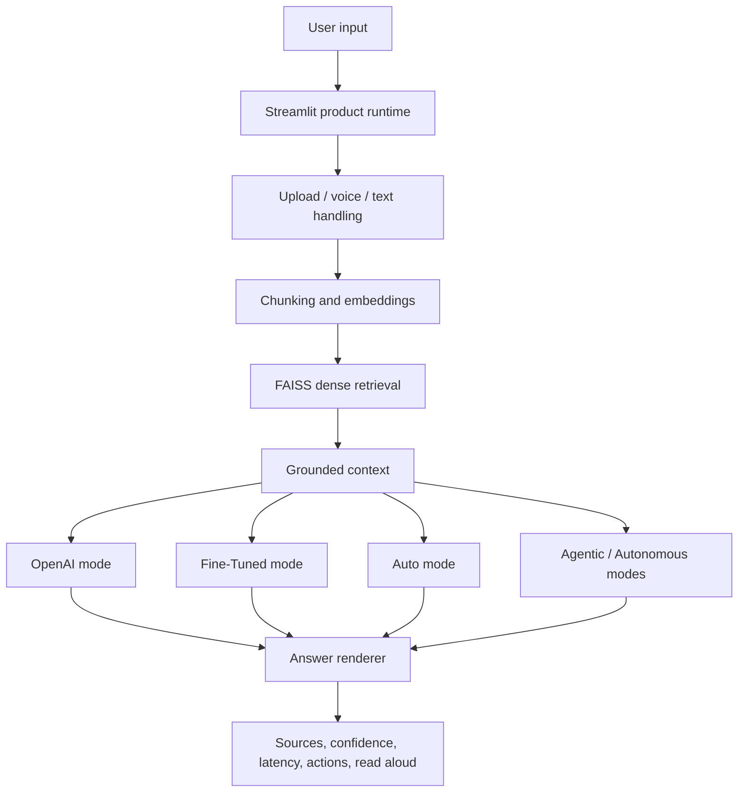

# AI Agent Runtime

This folder contains the live deployed Banking & Finance AI Agent runtime. It is still named `01-rag-system` for Hugging Face deployment compatibility, but its role in the system is the agent runtime: Streamlit UI, retrieval, model routing, agentic workflows, uploads, voice controls, source cards, and evaluation.

## Purpose

Provide a product-quality AI workflow interface for banking, compliance, and financial knowledge tasks. The runtime prioritizes grounded answers, clear confidence signals, source visibility, multilingual support, and stable user interaction.

## Architecture


```mermaid
flowchart TD
    A["User input"] --> B["Streamlit product runtime"]
    B --> C["Upload / voice / text handling"]
    C --> D["Chunking and embeddings"]
    D --> E["FAISS dense retrieval"]
    E --> F["Grounded context"]
    F --> G["OpenAI mode"]
    F --> H["Fine-Tuned mode"]
    F --> I["Auto mode"]
    F --> J["Agentic / Autonomous modes"]
    G --> K["Answer renderer"]
    H --> K
    I --> K
    J --> K
    K --> L["Sources, confidence, latency, actions, read aloud"]
```

## Key Files

| File or folder | Role |
|---|---|
| `app.py` | Streamlit entry point used by the live Hugging Face Space. |
| `core/product_runtime.py` | Main product orchestration, mode selection, retrieval calls, session state, and response handling. |
| `core/agentic_runtime.py` | Agentic/autonomous workflow implementation and tool-style reasoning layer. |
| `core/retriever.py` | Shared context retrieval over runtime indexes. |
| `core/vector_store.py` | FAISS vector store construction. |
| `features/product_ui.py` | Premium UI cards, sidebar, metrics, and answer rendering. |
| `features/voice_input.py` / `features/voice_output.py` | Speech-to-text and text-to-speech integration paths. |
| `models/openai_mode.py` | OpenAI answer path. |
| `models/finetuned_mode.py` | Fine-tuned model endpoint path. |
| `models/auto_router.py` | Candidate scoring and automatic model selection. |
| `evaluation/` | Domain and multilingual evaluation packs, runners, summaries, and reports. |

## How To Run

```bash
cd 01-rag-system
pip install -r requirements.txt
streamlit run app.py
```

Required environment:

```env
OPENAI_API_KEY=
HF_TOKEN=
OPENAI_MODEL=gpt-4o-mini
FINETUNED_MODEL_ID=RakeshMadasani/banking-finance-mistral-qlora
```

## Inputs And Outputs

Inputs:

- User questions in English or supported multilingual prompts.
- PDF, DOCX, TXT, and image-oriented upload workflows.
- Voice input where browser/runtime support is available.
- Mode selection across OpenAI, Fine-Tuned, Auto, Agentic Workspace, and Autonomous Max.

Outputs:

- Source-grounded answer cards.
- Confidence label and latency.
- Retrieved chunk/source metadata.
- Copy/export actions and read-aloud audio.
- Agent trace and audit-style context where agentic modes are used.

## Evaluation Notes

The runtime includes:

- 120 domain prompts in `evaluation/evaluation_queries.md`.
- 120 multilingual prompts in `evaluation/evaluation_multilingual.md`.
- Runner and summarizer scripts for repeatable evaluation.
- Committed snapshots under `evaluation/results`.
- A generated report under `evaluation/reports/latest_portfolio_report.md`.
- Decision-critical tests under `tests/`.

Latest committed snapshots show about 2.03s average latency for available rows in both domain and multilingual evaluation exports.

## Limitations

- Current retrieval is FAISS dense vector retrieval. BM25 and reciprocal rank fusion are roadmap work unless implemented later.
- Fine-Tuned mode requires a configured endpoint or compatible local runtime.
- Streamlit session state is suitable for live demos but not durable production memory by itself.
- Outputs are educational and must not be treated as legal, investment, financial, or compliance advice.
