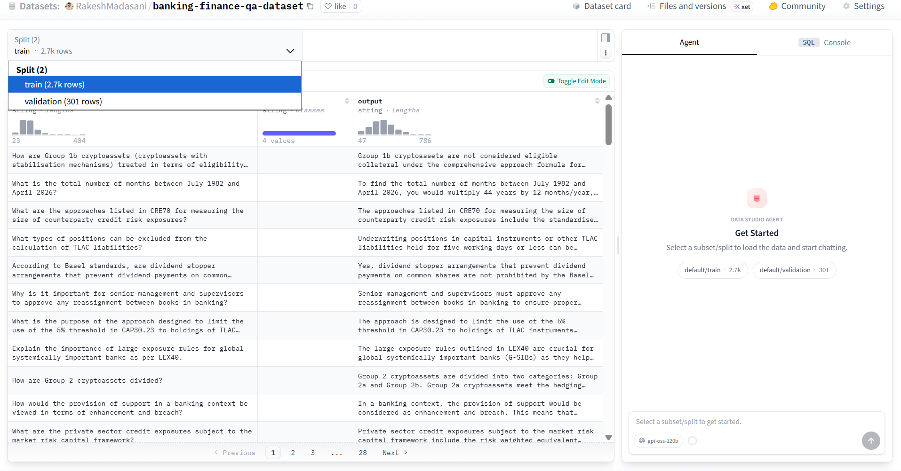
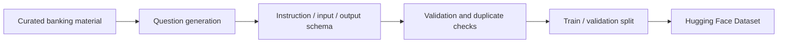

# BankingQA Dataset

This folder contains the BankingQA-3K instruction dataset workflow used by the Banking & Finance AI Agent.

## Purpose

Create a reusable domain dataset for banking and financial compliance instruction tuning. The dataset turns curated banking material into structured instruction-response pairs that support the downstream QLoRA adaptation workflow.

## Dataset

[banking-finance-qa-dataset](https://huggingface.co/datasets/RakeshMadasani/banking-finance-qa-dataset)



## Summary

| Item | Value |
|---|---:|
| Total examples | 3,002 |
| Train samples | 2,701 |
| Validation samples | 301 |
| Format | Alpaca-style instruction data |
| Language | English |
| Domain | Banking, finance, AML, KYC, compliance |

## Architecture



## Coverage

- AML, KYC, CDD, and EDD.
- FDIC deposit insurance.
- Basel III capital concepts.
- RBI and India banking compliance topics.
- SAR, CTR, transaction monitoring, and financial crime concepts.
- General banking and finance fundamentals.

## Key Files

| File | Role |
|---|---|
| `generate_dataset.py` | Builds instruction-response examples from curated material. |
| `validate_dataset.py` | Checks structure, duplicates, and dataset quality signals. |
| `upload_to_hf.py` | Publishes dataset artifacts and dataset card to Hugging Face. |
| `screenshots/` | Published dataset page screenshots for portfolio review. |

## How To Run

```bash
cd 02-qa-dataset
python generate_dataset.py
python validate_dataset.py
python upload_to_hf.py
```

Set `HF_TOKEN` before upload if publishing to the Hub.

## Inputs And Outputs

Inputs:

- Curated banking and compliance source material.
- Topic coverage plan across AML, KYC, FDIC, RBI, Basel III, and banking operations.

Outputs:

- Alpaca-style dataset with `instruction`, `input`, and `output` fields.
- Train and validation splits.
- Hugging Face dataset repository.

## Evaluation Notes

The dataset is validated structurally before publishing. It is designed for fine-tuning and domain adaptation, not as a formal legal or regulatory authority. Downstream quality should be measured through model evaluation and grounded answer testing.

## Limitations

- The dataset is English-only in its current published form.
- Coverage is strongest for banking/compliance concepts represented in the curated material.
- Dataset answers should be treated as training material, not official regulatory advice.
