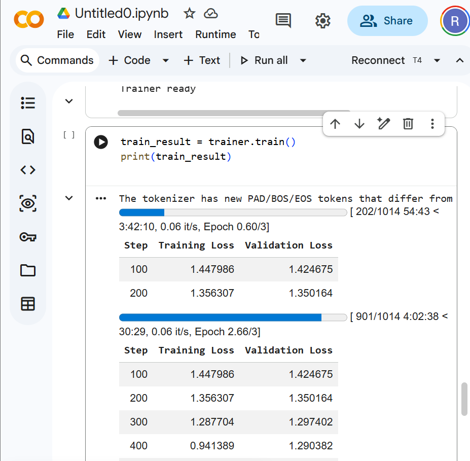

# Banking Finance QLoRA Fine-Tuned Model

This project contains the fine-tuning workflow for adapting a Mistral-based LLM to banking and finance question answering.

## Model
[banking-finance-mistral-qlora](https://huggingface.co/RakeshMadasani/banking-finance-mistral-qlora)

## Published Model Page

## Training Screenshot

## Recommended Demo Questions

If you want to capture a stronger inference screenshot for this project, use these questions:

- `What is the FDIC deposit insurance limit in the United States?`
- `What are the three stages of money laundering?`
- `What is the difference between AML and KYC?`

These prompts are short, easy to judge, and representative of the banking/compliance domain adaptation shown by the model.

## Base Model
`mistralai/Mistral-7B-Instruct-v0.3`

## Fine-Tuning Summary
- Method: QLoRA
- Quantization: 4-bit NF4
- LoRA rank: 16
- LoRA alpha: 32
- LoRA dropout: 0.05
- Training samples: 2,701
- Validation samples: 301
- Global steps: 676
- Final train loss: 1.13

## What it demonstrates
- parameter-efficient fine-tuning
- PEFT/LoRA configuration
- domain adaptation using custom data
- Hugging Face model publishing

## Output Snapshot

Example sample outputs from the fine-tuned model included banking-domain answers for prompts such as:
- FDIC deposit insurance limits
- the stages of money laundering
- Basel-related banking questions

These examples showed that the adapter was capable of producing domain-specific responses after fine-tuning, even though formal benchmark scoring is still a planned improvement.

## Why it stands out
This project shows that the portfolio goes beyond app development and dataset creation into actual model adaptation. Publishing the adapter with a model card, tokenizer files, and LoRA configuration makes the work visible and inspectable as a real model artifact.
