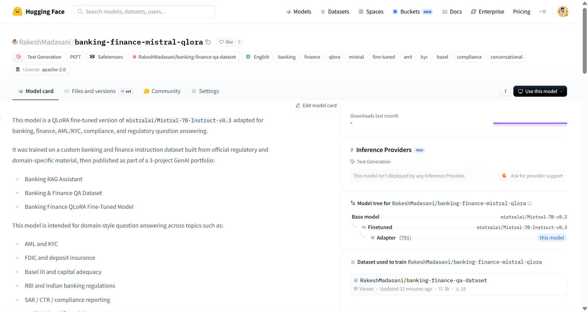

# Domain Model Adaptation

This folder contains the QLoRA fine-tuning workflow used to adapt Mistral-7B-Instruct-v0.3 to banking and financial compliance terminology.

## Purpose

Show the model adaptation layer behind the Banking & Finance AI Agent. The goal is not only to call external APIs, but to demonstrate data preparation, parameter-efficient fine-tuning, adapter publishing, and inference testing.

## Model

[banking-finance-mistral-qlora](https://huggingface.co/RakeshMadasani/banking-finance-mistral-qlora)



## Architecture


```mermaid
flowchart LR
    A["BankingQA-3K dataset"] --> B["Prompt formatting"]
    B --> C["Mistral-7B-Instruct-v0.3"]
    C --> D["4-bit NF4 quantization"]
    D --> E["LoRA adapter training"]
    E --> F["Validation / training metrics"]
    F --> G["Published Hugging Face adapter"]
```

## Fine-Tuning Summary

| Item | Value |
|---|---|
| Base model | `mistralai/Mistral-7B-Instruct-v0.3` |
| Method | QLoRA |
| Quantization | 4-bit NF4 |
| LoRA rank | 16 |
| LoRA alpha | 32 |
| LoRA dropout | 0.05 |
| Training samples | 2,701 |
| Validation samples | 301 |
| Global steps | 676 |
| Final train loss | 1.13 |

## Key Files

| File | Role |
|---|---|
| `Banking_QLoRA_Mistral7B_updated.ipynb` | Main notebook for dataset formatting, QLoRA setup, training, and publishing. |
| `inference_demo.py` | Lightweight script for loading the adapter and testing domain prompts. |
| `screenshots/` | Published model page and training-progress screenshots. |

## How To Run

The notebook is the main training artifact. For local inference, use:

```bash
cd 03-qlora-finetuning
python inference_demo.py
```

You need access to the base model, the published adapter, and a compatible local GPU/CPU environment. Full 7B inference can be heavy on consumer machines.

## Inputs And Outputs

Inputs:

- BankingQA-3K instruction dataset.
- Mistral-7B-Instruct-v0.3 base model.
- PEFT/QLoRA configuration.

Outputs:

- Published LoRA adapter.
- Training metrics.
- Model card and inference demo path.

## Evaluation Notes

The current folder documents training configuration and final train loss. A stronger future benchmark should compare the base model, adapter model, OpenAI path, and Auto routing on the same held-out banking evaluation pack.

## Limitations

- This publishes an adapter artifact, not a fully hosted standalone inference service.
- Runtime quality depends on loading the compatible base model plus adapter correctly.
- The model should be evaluated on held-out prompts before making strong accuracy claims.
