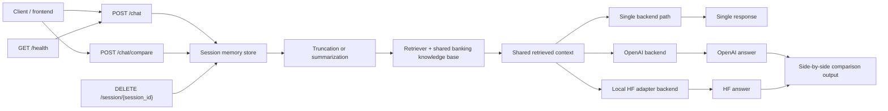

# Conversational Memory Backend

 project adds a FastAPI-based conversational layer on top of the banking RAG assistant so interactions become session-aware instead of stateless. It introduces session memory, controlled history retention, and summarization for longer conversations while keeping the underlying retrieval-backed banking Q&A workflow reusable. The backend supports both an OpenAI path for quick deployment and a local Hugging Face adapter path for a stronger end-to-end portfolio story.

## What this project does

- wraps the existing banking RAG logic behind a FastAPI service
- maintains per-session conversation history for multi-turn follow-up questions
- truncates and summarizes long sessions to control prompt growth
- exposes clean API endpoints for chat, session clearing, and health checks
- supports switchable LLM backends via environment variable
- supports side-by-side backend comparison on the same retrieved context
- supports evaluation of memory-on vs memory-off coherence

## Architecture



## Project Structure

```text
04-conversational-memory/
|-- app/
|   |-- __init__.py
|   |-- main.py
|   |-- memory.py
|   |-- models.py
|   |-- rag_chain.py
|   `-- summarizer.py
|-- evaluation/
|   |-- coherence_eval.py
|   `-- questions.csv
|-- tests/
|   `-- test_memory.py
|-- .env.example
|-- README.md
`-- requirements.txt
```

## API Endpoints

### `POST /chat`
Accepts a user message plus an optional `session_id` and returns:

- `session_id`
- `response`
- `turn_count`
- `sources`
- `confidence`
- `history_used`
- `summary_used`

### `DELETE /session/{session_id}`
Clears the stored memory for a given session.

### `GET /health`
Returns a lightweight health status and current session count.

### `POST /chat/compare`
Runs both backends on the same question and retrieved context, then returns both answers side by side for direct comparison.

## How to run

### Prerequisites

- Python 3.10+
- banking knowledge files available in `01-rag-system/`
- one backend configured:
  - `openai` with `OPENAI_API_KEY`
  - `local_hf` with model + adapter access and enough local GPU/compute

### Install

```bash
pip install -r requirements.txt
```

### Environment

```bash
LLM_BACKEND=openai
OPENAI_API_KEY=your_openai_api_key_here
OPENAI_MODEL=gpt-4o-mini
LOCAL_HF_MODEL_ID=mistralai/Mistral-7B-Instruct-v0.3
LOCAL_HF_ADAPTER_ID=RakeshMadasani/banking-finance-mistral-qlora
LOCAL_HF_DEVICE=auto
```

### Backend options

#### Option A - OpenAI backend

```bash
LLM_BACKEND=openai
OPENAI_API_KEY=your_openai_api_key_here
OPENAI_MODEL=gpt-4o-mini
```

#### Option B - Local HF backend

```bash
LLM_BACKEND=local_hf
LOCAL_HF_MODEL_ID=mistralai/Mistral-7B-Instruct-v0.3
LOCAL_HF_ADAPTER_ID=RakeshMadasani/banking-finance-mistral-qlora
LOCAL_HF_DEVICE=auto
```

This path is stronger for the portfolio because it links Project 3 directly into Project 4, but it also requires a compatible local environment and enough compute to load the base model plus adapter.

### Run the API

```bash
uvicorn app.main:app --reload --port 8000
```

### Example request

```bash
curl -X POST "http://127.0.0.1:8000/chat" ^
  -H "Content-Type: application/json" ^
  -d "{\"message\":\"What is KYC?\",\"session_id\":\"demo-session\",\"use_memory\":true}"
```

### Example comparison request

```bash
curl -X POST "http://127.0.0.1:8000/chat/compare" ^
  -H "Content-Type: application/json" ^
  -d "{\"message\":\"What is the difference between AML and KYC?\",\"session_id\":\"compare-session\",\"use_memory\":true}"
```

## Evaluation

The `evaluation/coherence_eval.py` script compares memory-off and memory-on responses on multi-turn conversations such as:

- KYC followed by follow-up questions about its components and its relation to AML
- Basel III followed by capital requirement and Basel II comparison prompts
- SAR followed by reporting-threshold clarification

Run:

```bash
python evaluation/coherence_eval.py
```

This prints:

- average coherence score with memory off
- average coherence score with memory on
- relative improvement

Use the resulting percentage as evidence for a claim like `17% improvement` only when your real run produces that number.

## Execution Proof

This project has already been exercised locally at a lightweight level:

- `/health` returned a successful status response
- `/chat` returned a real answer
- a follow-up `/chat` call on the same session showed `history_used = true`
- `/chat/compare` is implemented and reachable, with the local HF runtime path dependent on the local model environment

For the current execution record, see [`evaluation/results.md`](./evaluation/results.md).

## Design Decisions

### Why truncation + summarization instead of only windowing?

- simple windowing drops older context entirely
- summarization preserves earlier intent and constraints
- retaining the most recent turns keeps the API responsive for active follow-ups
- current session store is in-process for demo simplicity; a production upgrade path would be Redis or Postgres

### Why reuse the Project 1 knowledge base?

- keeps the backend directly tied to your deployed banking RAG system
- strengthens the portfolio story across app layer and backend layer
- makes evaluation easier because the data and retrieval domain stay consistent

### Why support switchable backends?

- OpenAI is the fastest path to ship and demo the architecture
- a local HF backend creates a stronger data -> model -> backend portfolio chain
- the same FastAPI layer can serve both paths without changing the API contract

### Why add `/chat/compare`?

- it makes backend tradeoffs visible instead of hidden behind a config switch
- it lets you compare a general-purpose model and a domain-adapted model on the same retrieved evidence
- it creates a stronger portfolio talking point than a simple backend toggle

## What this adds to the portfolio

This project upgrades the overall portfolio from a collection of artifacts into a more production-oriented system story:

- Project 1 provides the deployed RAG interface
- Project 2 provides the banking instruction dataset
- Project 3 provides the fine-tuned model artifact
- Project 4 adds the backend memory and orchestration layer for multi-turn interaction

## Execution Notes

See [`evaluation/results.md`](./evaluation/results.md) for a lightweight execution record covering:

- successful local `/health` response
- successful local `/chat` response
- successful memory follow-up showing `history_used = true`
- the current state of `/chat/compare` validation
