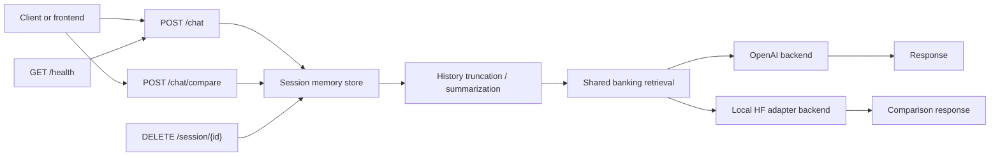

# Memory And Orchestration Backend

This folder contains a FastAPI conversational memory backend for the Banking & Finance AI Agent. It adds session handling, controlled history retention, summarization, and backend comparison around the same banking knowledge workflow.

## Purpose

Move the system beyond stateless single-turn answers by introducing reusable API endpoints and memory-aware orchestration. This layer is separate from the live Streamlit Space so it can evolve toward production API deployment without destabilizing the public demo.

## Architecture


```mermaid
flowchart LR
    A["Client or frontend"] --> B["POST /chat"]
    A --> C["POST /chat/compare"]
    B --> D["Session memory store"]
    C --> D
    D --> E["History truncation / summarization"]
    E --> F["Shared banking retrieval"]
    F --> G["OpenAI backend"]
    F --> H["Local HF adapter backend"]
    G --> I["Response"]
    H --> J["Comparison response"]
    K["DELETE /session/{id}"] --> D
    L["GET /health"] --> B
```

## Key Files

| File | Role |
|---|---|
| `app/main.py` | FastAPI application and route definitions. |
| `app/memory.py` | Session memory store and state handling. |
| `app/rag_chain.py` | Retrieval and backend generation logic. |
| `app/summarizer.py` | Conversation summarization support. |
| `app/models.py` | Request and response models. |
| `evaluation/coherence_eval.py` | Memory-on versus memory-off coherence evaluation. |
| `tests/test_memory.py` | Unit tests for memory behavior. |

## How To Run

```bash
cd 04-conversational-memory
pip install -r requirements.txt
copy .env.example .env
uvicorn app.main:app --reload --port 8000
```

Example:

```bash
curl -X POST "http://127.0.0.1:8000/chat" ^
  -H "Content-Type: application/json" ^
  -d "{\"message\":\"What is KYC?\",\"session_id\":\"demo-session\",\"use_memory\":true}"
```

## Inputs And Outputs

Inputs:

- User message.
- Optional `session_id`.
- Optional memory usage flag.
- Backend configuration via environment variables.

Outputs:

- Session-aware answer.
- Sources and confidence.
- Turn count.
- Flags showing whether history or summary was used.
- Side-by-side backend comparison through `/chat/compare`.

## Evaluation Notes

The coherence evaluation compares memory-off and memory-on behavior across follow-up conversations. Claims such as percentage improvement should only be made from actual generated evaluation output, not assumed values.

## Limitations

- The current memory store is lightweight and in-process; production use should move to Redis, Postgres, or another durable store.
- Local Hugging Face adapter inference depends on a compatible environment and sufficient compute.
- This backend is a system-design layer and is not the live public Space entry point.
