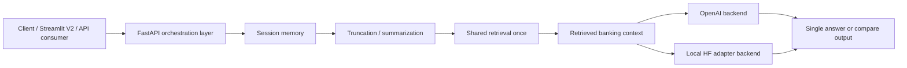

# Banking GenAI System V2

Version B is a separate upgraded system that keeps the original Streamlit RAG assistant intact while adding a stronger backend architecture for AI/ML/software interviews. It reuses the retrieval ideas from Version A, connects to the fine-tuned model path from Project 3, and packages the orchestration logic behind a FastAPI API with memory and compare mode.

## 1. Final Architecture



### How the projects connect

- **Project 1** supplies the retrieval pattern and banking knowledge base
- **Project 3** supplies the fine-tuned model path for the local HF backend
- **Project 4** introduced the memory and compare-mode ideas
- **Version B** combines those ideas into one cleaner integrated system

### How memory fits into the pipeline

Memory happens before generation. The API loads the session history, summarizes it when it grows too long, and sends the resulting history together with the retrieved context into the generation path.

### How compare mode works

Retrieval happens once. The same retrieved context is then passed to:

- an OpenAI backend
- a local HF / fine-tuned model backend

The response returns both answers side by side so they can be compared on identical grounding.

## 2. Repo / Folder Structure

```text
05-integrated-banking-genai-v2/
|-- app/
|   |-- __init__.py
|   |-- config.py
|   |-- models.py
|   |-- memory.py
|   |-- summarizer.py
|   |-- retriever.py
|   |-- backends.py
|   |-- rag_chain.py
|   `-- main.py
|-- evaluation/
|   |-- questions.csv
|   `-- evaluate_vb.py
|-- integration/
|   `-- streamlit_v2_example.py
|-- .env.example
|-- README.md
`-- requirements.txt
```

## 3. Exact Implementation Plan

### Build order

1. **Config + models**
- define environment variables and API response shapes first

2. **Memory + summarizer**
- add session memory and safe truncation before touching generation logic

3. **Retriever**
- reuse the Version A knowledge base and retrieval design
- keep retrieval shared and independent from backend selection

4. **Backends**
- ship OpenAI first
- keep local HF as a real integration path, but treat it honestly as more environment-sensitive

5. **RAG chain**
- combine shared retrieval, prompt assembly, and backend invocation

6. **FastAPI**
- add `/chat`, `/chat/compare`, `/health`, and `/session/{id}`

7. **Integration**
- add a Streamlit client example without changing Version A

8. **Evaluation**
- add a script structure that compares Version A vs Version B on latency, groundedness, coherence, and source usage

### What is reused from Version A

- banking knowledge files
- retrieval design
- prompt-grounding philosophy
- domain scope and evaluation questions

### What is placeholder first vs fully integrated later

- OpenAI backend is the easiest first working path
- local HF backend is implemented as a real path, but may still need a compatible GPU/runtime to be fully demonstrated

## 4. API Endpoints

### `POST /chat`
- single backend path using the configured default backend

### `POST /chat/compare`
- runs both OpenAI and local HF on the same retrieved context

### `GET /health`
- status plus current session count

### `DELETE /session/{session_id}`
- clears session memory

## 5. Integration with current Project 1

Keep Version A unchanged.

If you want a new Streamlit interface that uses Version B, point a separate frontend at the FastAPI backend.

Example flow:

1. leave `01-rag-system/app.py` untouched
2. run Version B FastAPI separately
3. use [`integration/streamlit_v2_example.py`](./integration/streamlit_v2_example.py) as the first integration example

### Example Streamlit integration idea

```python
result = requests.post(
    f"{BACKEND_URL}/chat",
    json={"message": question, "session_id": session_id, "use_memory": True},
    timeout=60,
).json()
```

For compare mode:

```python
result = requests.post(
    f"{BACKEND_URL}/chat/compare",
    json={"message": question, "session_id": session_id, "use_memory": True},
    timeout=60,
).json()
```

## 6. Evaluation Design

Use Version A as the baseline and Version B as the upgraded system.

### Useful metrics

- **latency**: end-to-end response time
- **groundedness**: whether the answer is supported by retrieved sources
- **answer quality**: human review or rubric-based scoring
- **multi-turn coherence**: whether follow-up answers use earlier turns correctly
- **source usage**: average source count and whether answers return retrieval evidence

### Evaluation approach

- reuse the existing banking-domain questions where possible
- add small multi-turn conversation sets for memory testing
- run Version A and Version B on the same prompts
- log results in CSV or JSON and summarize at the README level

The included `evaluation/evaluate_vb.py` is a starter structure. It does not invent fake numbers.

## 7. Engineering Tradeoffs

### What improves groundedness

- sharing retrieval once before generation
- forcing both backends to answer from the same retrieved evidence
- keeping a clear fallback when context is insufficient

### What may increase latency

- compare mode
- longer memory history
- summarization steps
- local HF inference

### When to use each mode

- **OpenAI only**: fastest path to a stable demo
- **local model only**: best when proving full ownership of the stack
- **compare mode**: best for evaluation, demos, and interview storytelling

### Why this architecture is stronger for interviews

Because it shows:

- backend orchestration
- modular retrieval/generation separation
- shared context design
- evaluation awareness
- an upgrade path from baseline demo to production-style system

## 8. README-ready explanation

Version B is a separate upgraded banking GenAI system that keeps the original RAG assistant intact while adding FastAPI orchestration, session memory, shared retrieval, and side-by-side model comparison. The same retrieved context can be sent to both OpenAI and a fine-tuned banking model, making it easier to compare general-purpose and domain-adapted responses on identical grounding.

## Interview explanation

I kept the original RAG assistant as a baseline, then built a second version with a separate FastAPI orchestration layer. In Version B, retrieval happens once, conversational memory is managed independently of the frontend, and compare mode sends the same grounded context to both OpenAI and my fine-tuned model so their responses can be evaluated side by side.

## LinkedIn / project description

Built Version B of my banking GenAI system as a modular FastAPI backend with session memory, shared retrieval, compare mode, and support for both OpenAI and local fine-tuned model backends, while preserving the original RAG assistant as a baseline.
