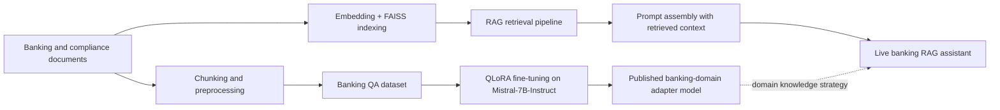

# Banking & Finance GenAI Portfolio

**Rakesh Madasani** · [Hugging Face](https://huggingface.co/RakeshMadasani) · [LinkedIn](https://www.linkedin.com/in/rakesh-madasani-b217b71b0/) · [Email](mailto:rakeshee230@gmail.com)

An end-to-end GenAI portfolio focused on banking, finance, compliance, and regulatory question answering.

This portfolio includes:
- a live RAG assistant for grounded banking Q&A
- a custom 3,002-sample banking instruction dataset
- a QLoRA fine-tuned Mistral model adapted to the domain

## Projects

### 1. Banking Finance RAG Assistant
Live demo: [banking-finance-rag](https://huggingface.co/spaces/RakeshMadasani/banking-finance-rag)

A deployed RAG application built with Streamlit, LangChain, FAISS, and OpenAI for source-grounded banking and compliance question answering.

**Project 1 Demo**

Live product view with the app title and top-level metrics, followed by a low-latency answer example from the deployed app:


### 2. Banking & Finance QA Dataset
Dataset: [banking-finance-qa-dataset](https://huggingface.co/datasets/RakeshMadasani/banking-finance-qa-dataset)

A 3,002-sample Alpaca-style instruction dataset covering AML, KYC, Basel III, FDIC, RBI, compliance, and financial concepts.

**Project 2 Demo**

Published Hugging Face dataset view showing train and validation splits:


### 3. Banking Finance QLoRA Fine-Tuned Model
Model: [banking-finance-mistral-qlora](https://huggingface.co/RakeshMadasani/banking-finance-mistral-qlora)

A domain-adapted Mistral-based model fine-tuned using QLoRA on the custom banking dataset.

**Project 3 Demo**

Published Hugging Face model page for the banking-domain QLoRA adapter:


**Suggested live demo prompts**
- What is the FDIC deposit insurance limit in the United States?
- What are the three stages of money laundering?
- What is the difference between AML and KYC?

## Training Snapshot

| Item | Value |
|---|---|
| Base model | `mistralai/Mistral-7B-Instruct-v0.3` |
| Fine-tuning method | QLoRA |
| Training samples | 2,701 |
| Validation samples | 301 |
| Global steps | 676 |
| Final train loss | 1.13 |

## Why this portfolio matters

These projects show work across:
- application development
- retrieval pipelines
- dataset creation
- model fine-tuning
- deployment and documentation

## Architecture



## Comparison Snapshot

This is a qualitative comparison of the base model and the fine-tuned model on banking-domain prompts. It is meant to show the direction of improvement, not to replace a formal benchmark.

| Prompt type | Base model behavior | Fine-tuned model behavior |
|---|---|---|
| FDIC insurance questions | Usually correct, but often generic and less domain-focused | More direct, domain-specific answers with cleaner banking phrasing |
| AML / KYC concepts | Can answer broadly, but may stay high-level | More targeted banking/compliance language and stronger instructional tone |
| India-specific banking regulation | More likely to be vague or mix jurisdictions | Better alignment with RBI / banking-domain phrasing from the custom dataset |
| Compliance terminology | Understands concepts, but responses can be inconsistent | More consistent responses on SAR, CTR, Basel, AML, and KYC topics |

## Evaluation Template

Use this structure once you finish the measured comparison run:

| System | Accuracy | Groundedness | Hallucination Risk | Notes |
|---|---|---|---|---|
| Base model | To be measured | To be measured | To be measured | General-purpose baseline |
| RAG assistant | To be measured | To be measured | To be measured | Retrieval-backed answer generation |
| Fine-tuned QLoRA model | To be measured | To be measured | To be measured | Domain-adapted banking responses |

Current repo status:
- screenshots and qualitative examples are included
- formal measured benchmarking is the next planned improvement

## Visible Code Entry Points

This repo now includes direct technical entrypoints rather than only project summaries:

- `01-rag-system/app.py`
- `01-rag-system/requirements.txt`
- `01-rag-system/evaluation/compute_metrics.py`
- `02-qa-dataset/generate_dataset.py`
- `02-qa-dataset/validate_dataset.py`
- `02-qa-dataset/upload_to_hf.py`
- `03-qlora-finetuning/Banking_QLoRA_Mistral7B_updated.ipynb`
- `03-qlora-finetuning/inference_demo.py`

## Repo Structure

```text
banking-genai-portfolio/
|-- README.md
|-- 01-rag-system/
|   `-- README.md
|-- 02-qa-dataset/
|   `-- README.md
`-- 03-qlora-finetuning/
    `-- README.md
```

## Next steps
- base vs fine-tuned model comparison
- screenshots and walkthroughs
- FastAPI backend for conversational memory

## License
Apache-2.0 where applicable. See individual project repositories for details.
