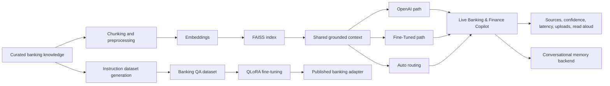
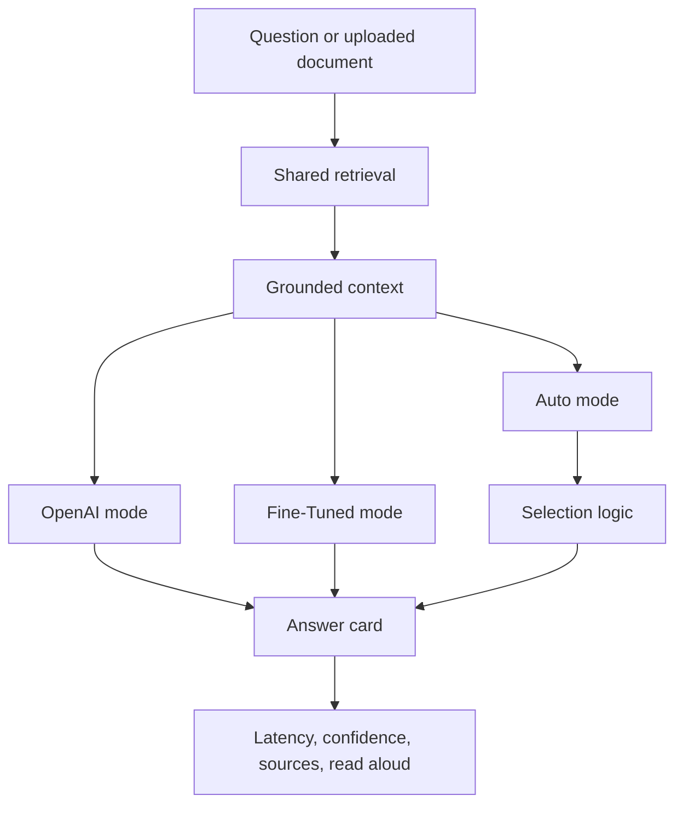
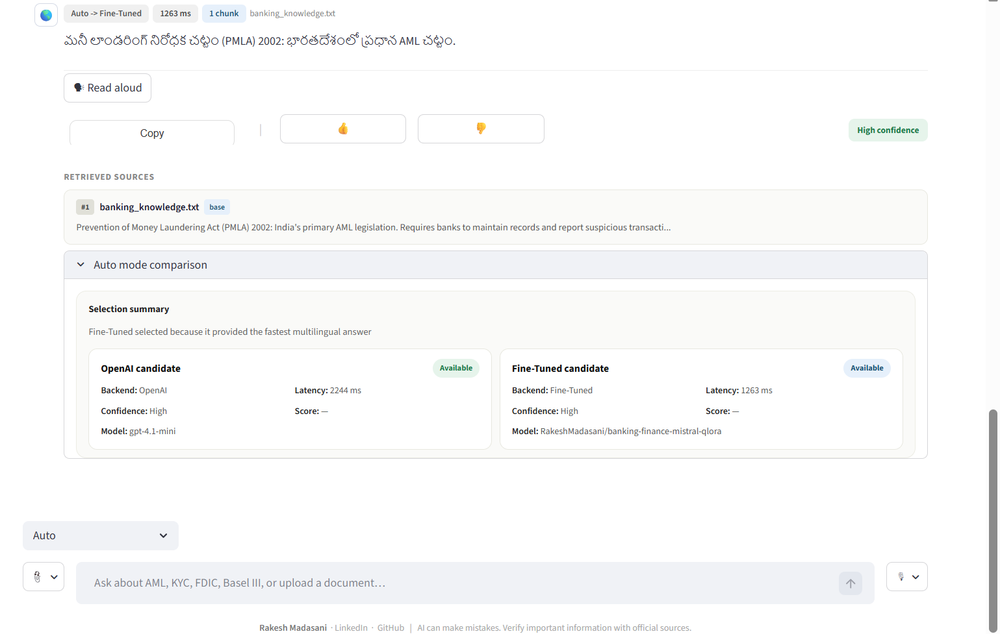

# Banking & Finance GenAI Portfolio

**Rakesh Madasani**  
[Live Banking & Finance Copilot](https://huggingface.co/spaces/RakeshMadasani/banking-finance-rag) | [Hugging Face Profile](https://huggingface.co/RakeshMadasani) | [GitHub](https://github.com/rakeshmadasaniai/banking-genai-portfolio) | [LinkedIn](https://www.linkedin.com/in/rakesh-madasani-b217b71b0/)

This repository is the full build story behind my Banking & Finance Copilot: a live grounded AI product focused on USA and India banking, compliance, AML, KYC, FDIC, Basel III, and RBI workflows.

I did not want this to be a one-screen chatbot demo. I wanted it to behave like a real product:

- grounded on visible source material
- measurable with repeatable evaluation packs
- flexible across OpenAI, Fine-Tuned, and Auto routing
- multilingual enough for broader banking users
- strong enough to discuss as an engineering system, not just a UI

## Live Product

- **Live app:** [banking-finance-rag](https://huggingface.co/spaces/RakeshMadasani/banking-finance-rag)
- **Dataset:** [banking-finance-qa-dataset](https://huggingface.co/datasets/RakeshMadasani/banking-finance-qa-dataset)
- **Fine-tuned model:** [banking-finance-mistral-qlora](https://huggingface.co/RakeshMadasani/banking-finance-mistral-qlora)

## What This Repo Shows

| Layer | What is in the repo | Why it matters |
|---|---|---|
| Product | A live Banking & Finance Copilot | Shows a shipped, testable AI product |
| Retrieval | FAISS + banking knowledge + source cards | Keeps answers grounded and explainable |
| Data | A domain-specific QA dataset | Shows data ownership, not just prompting |
| Model | QLoRA fine-tuning workflow | Shows model adaptation beyond API usage |
| Backend | Conversational memory API | Shows system thinking and architecture depth |
| Evaluation | 120-query domain set + 120-query multilingual set | Shows repeatable measurement, not anecdotal demos |

## How The Portfolio Evolves

This repo is one system built in layers.

### 1. Product layer

I started with the user-facing assistant in [`01-rag-system`](01-rag-system). The goal was simple: if someone asks a banking or compliance question, the product should answer clearly and show the evidence behind the answer.

### 2. Data layer

Once the first retrieval system worked, I created a banking QA dataset in [`02-qa-dataset`](02-qa-dataset) so the domain logic would not live only inside prompts and chunk text.

### 3. Model layer

Then I fine-tuned a banking-domain adapter in [`03-qlora-finetuning`](03-qlora-finetuning) to show that I can move from application wiring into actual model adaptation.

### 4. Backend layer

Finally, I added session memory and orchestration work in [`04-conversational-memory`](04-conversational-memory), which made the portfolio feel more like a real product system than a single-page demo.

## Architecture

### End-to-End System



### Live Product Runtime



## Main Product: Banking & Finance Copilot

The main product lives in [`01-rag-system`](01-rag-system).

What it does well:
- grounded banking and compliance Q&A
- OpenAI, Fine-Tuned, and Auto modes
- source-backed answers with visible evidence
- PDF, DOCX, TXT, and image upload support
- multilingual answer support
- evaluation workflows committed alongside the app

### Current Product Screens




## Evaluation

The repo now includes two larger evaluation packs inside [`01-rag-system/evaluation`](01-rag-system/evaluation):

- `evaluation_queries.md`
  120 domain-specific banking, AML, KYC, Basel III, FDIC, RBI, CECL, and payments questions
- `evaluation_multilingual.md`
  120 multilingual questions grouped across OpenAI, Fine-Tuned, and Auto modes

The folder also includes:

- `run_eval_sets.py` to run both evaluation packs automatically
- `summarize_eval_sets.py` to summarize any generated CSV
- committed result snapshots in [`01-rag-system/evaluation/results`](01-rag-system/evaluation/results)

### Latest committed evaluation snapshots

**Domain evaluation pack**

| Metric | Result |
|---|---|
| Total prompts | 120 |
| Available evaluated rows | 80 |
| Average latency | 2037.0 ms |
| Median latency | 2036.0 ms |

**Multilingual evaluation pack**

| Metric | Result |
|---|---|
| Total prompts | 120 |
| Available evaluated rows | 80 |
| Average latency | 2031.8 ms |
| Median latency | 2031.5 ms |

Those results matter to me because they make the product discussable in a serious way. If someone asks how I tested it, I can point to committed query packs, reproducible runners, timestamped results, and summaries instead of hand-wavy claims.

## Other Projects In The Portfolio

### [02-qa-dataset](02-qa-dataset)

This is the dataset layer behind the banking system. It contains the curated QA data used to support model adaptation and domain coverage.


### [03-qlora-finetuning](03-qlora-finetuning)

This is the model adaptation layer. It shows the QLoRA workflow used to adapt a Mistral model for banking-domain answers.


### [04-conversational-memory](04-conversational-memory)

This is the backend layer that adds session memory, orchestration, and API structure to the broader assistant system.

## Best Entry Points In Code

If someone wants to inspect the implementation rather than just the screenshots, these are the best places to start:

- `01-rag-system/app.py`
- `01-rag-system/core/product_runtime.py`
- `01-rag-system/models/auto_router.py`
- `01-rag-system/evaluation/run_eval_sets.py`
- `01-rag-system/evaluation/summarize_eval_sets.py`
- `02-qa-dataset/generate_dataset.py`
- `03-qlora-finetuning/inference_demo.py`
- `04-conversational-memory/app/main.py`
- `04-conversational-memory/app/rag_chain.py`

## Repo Structure

```text
banking-genai-portfolio/
|-- README.md
|-- 01-rag-system/
|-- 02-qa-dataset/
|-- 03-qlora-finetuning/
`-- 04-conversational-memory/
```

## Closing Note

The part I value most in this portfolio is not that it calls an LLM. It is that the repo shows the full path from idea to product: retrieval, data, model work, backend orchestration, evaluation, and a live user-facing deployment that someone can test today.
