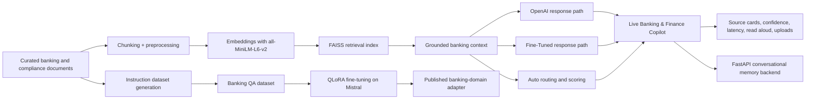
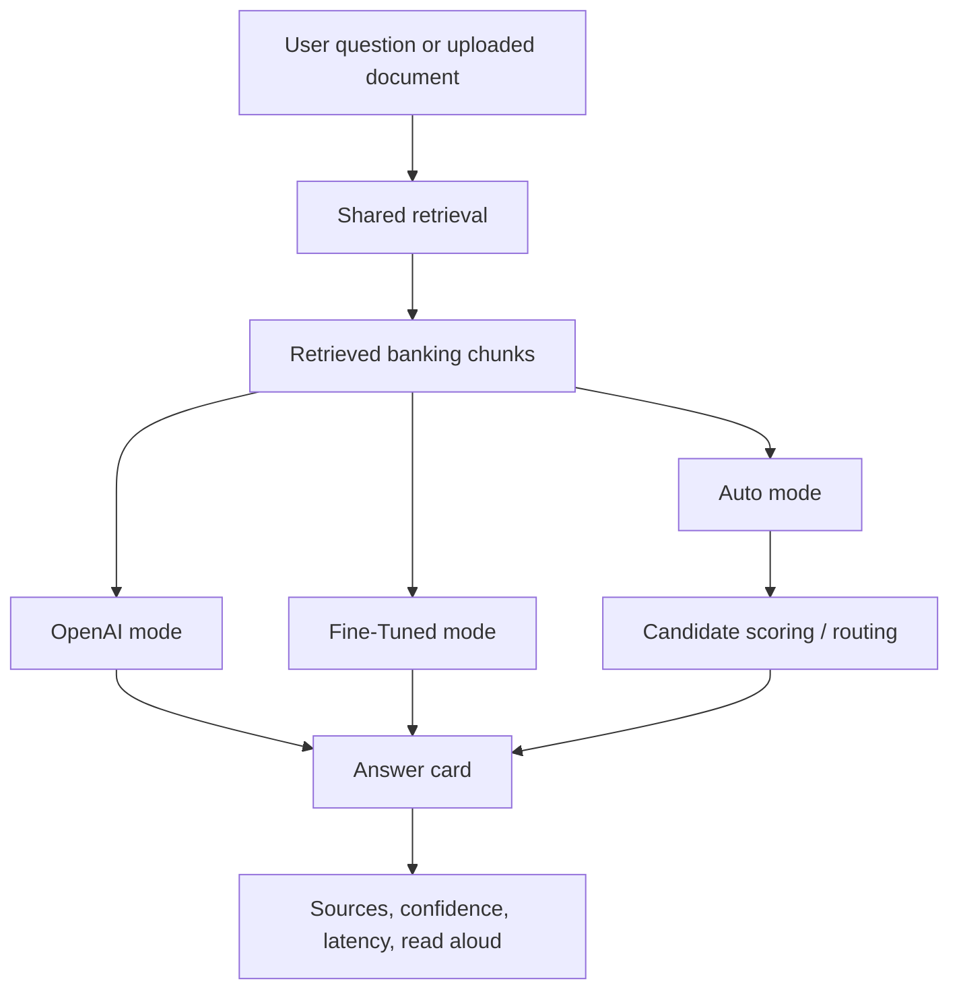
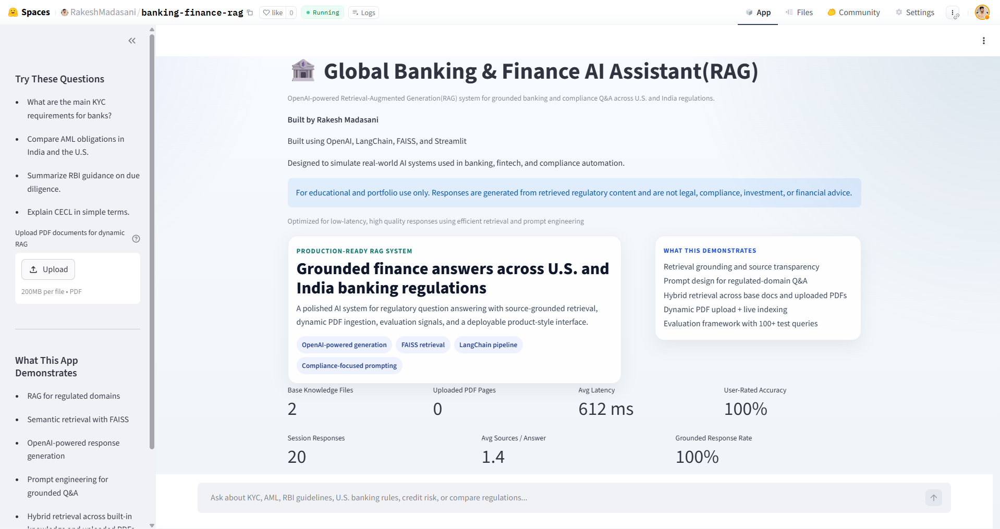
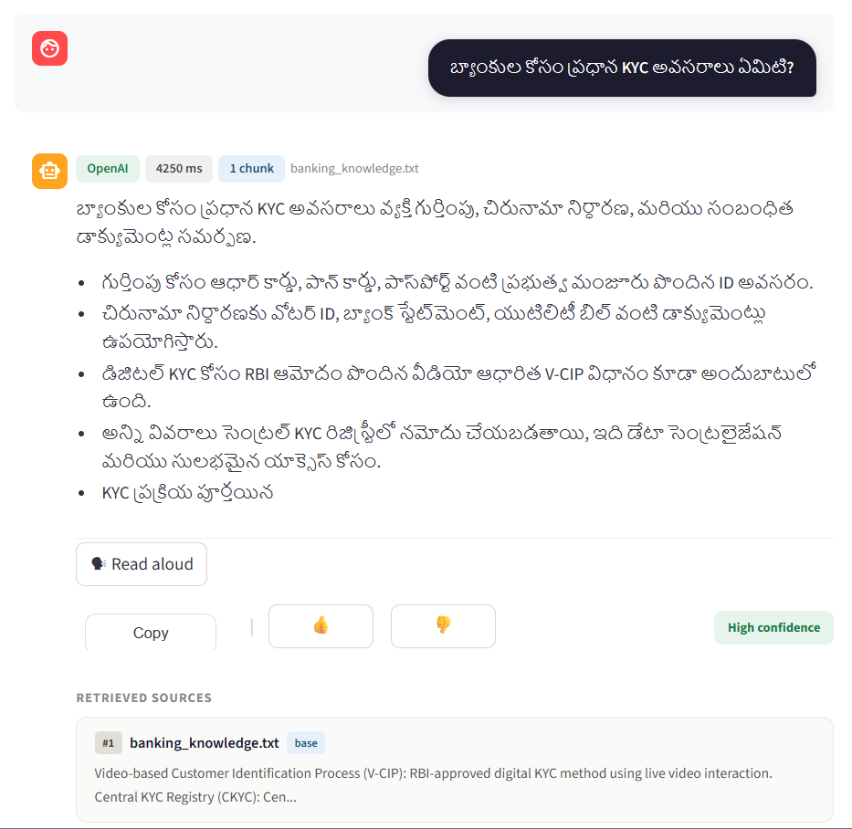
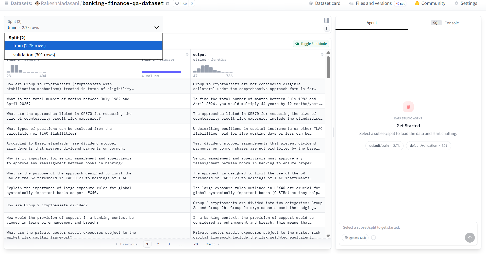
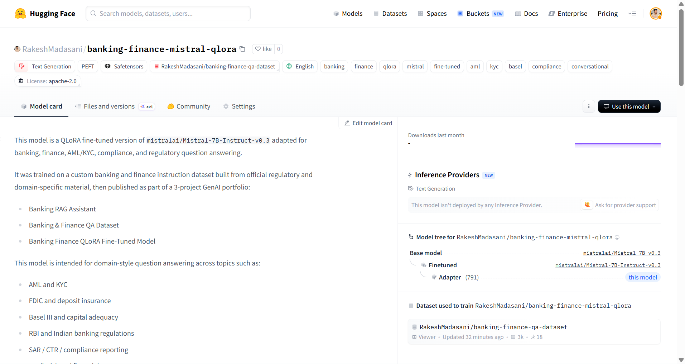

# Banking & Finance GenAI Portfolio

**Rakesh Madasani**  
[Live Hugging Face Space](https://huggingface.co/spaces/RakeshMadasani/banking-finance-rag) · [Hugging Face Profile](https://huggingface.co/RakeshMadasani) · [GitHub](https://github.com/rakeshmadasaniai/banking-genai-portfolio) · [LinkedIn](https://www.linkedin.com/in/rakesh-madasani-b217b71b0/)

This repository shows how I built a banking-focused generative AI system from the ground up, starting with a retrieval-based assistant and expanding it into a broader product and platform story across data curation, model adaptation, backend orchestration, conversational memory, evaluation, and deployment.

The portfolio is centered on one practical question:

**How do you make a banking AI assistant useful, grounded, explainable, and demo-ready for real financial questions instead of just producing generic LLM answers?**

That question drove every project in this repo.

## What This Portfolio Demonstrates

- product thinking, not just model experimentation
- grounded retrieval for banking and compliance use cases
- custom dataset creation for a narrow domain
- QLoRA-based model adaptation
- backend orchestration and memory-aware APIs
- evaluation across latency, grounding, and answer quality
- deployment of a recruiter-visible live demo

## Live Assets

- **Live app:** [banking-finance-rag](https://huggingface.co/spaces/RakeshMadasani/banking-finance-rag)
- **Dataset:** [banking-finance-qa-dataset](https://huggingface.co/datasets/RakeshMadasani/banking-finance-qa-dataset)
- **Fine-tuned model:** [banking-finance-mistral-qlora](https://huggingface.co/RakeshMadasani/banking-finance-mistral-qlora)

## Portfolio At A Glance

| Layer | What I built | Why it matters |
|---|---|---|
| Application | Banking & Finance Copilot | Shows a deployable, grounded AI product |
| Retrieval | FAISS + domain documents + source cards | Makes answers traceable instead of purely generative |
| Data | 3,002-sample banking QA dataset | Demonstrates domain-specific data ownership |
| Model | QLoRA fine-tuned Mistral adapter | Shows I can adapt a model, not just call one |
| Backend | FastAPI memory/comparison system | Adds production-style orchestration and session handling |
| Evaluation | Latency and multilingual evaluation workflow | Shows engineering discipline beyond screenshots |

## Best Way To Read This Repo

If you are reviewing this portfolio as a recruiter, engineer, or hiring manager, this is the fastest path:

1. Open the **live Space** and ask a banking or compliance question.
2. Read **Project 1** to understand the deployed product and retrieval architecture.
3. Read **Project 2** to see the domain dataset behind the model work.
4. Read **Project 3** to see the QLoRA fine-tuning workflow and published adapter.
5. Read **Project 4** to see how the system evolves into a backend-ready, memory-aware architecture.
6. Review the evaluation and deployment sections to see how the system was measured and shipped as a live product.

## System Story

This repo is not six unrelated folders. It is one system evolving in stages.

### Stage 1: Grounded banking assistant

I started by building a retrieval-augmented assistant for banking and compliance questions. The priority at this stage was groundedness:

- retrieve relevant banking context first
- answer from that context
- show the user where the answer came from

### Stage 2: Domain data ownership

Once the baseline RAG assistant worked, I created a banking and finance instruction dataset so the domain knowledge would not live only in prompts and retrieval chunks.

### Stage 3: Model adaptation

I then fine-tuned a Mistral-based model with QLoRA using the banking dataset. This made the portfolio stronger because it showed model adaptation, not just application wiring.

### Stage 4: Backend orchestration

After the dataset and fine-tuned model existed, I moved into backend architecture:

- session memory
- compare mode
- backend switching
- memory-aware conversation flow

## Architecture

### End-to-End Portfolio Architecture



### Runtime Architecture For The Live Product



### Architectural Decisions I Made On Purpose

- **Retrieval happens before generation** so the answer has visible support.
- **Auto mode retrieves once** and compares answer paths on shared evidence.
- **Dataset creation is separate from the app** so the model work is reusable.
- **Fine-tuning is adapter-based** to keep experimentation practical and cost-aware.
- **Memory is added as a backend concern** instead of burying it in frontend-only logic.

## Projects

### 1. [01-rag-system](01-rag-system)

**What it is:** the main deployed Banking & Finance Copilot.  
**Why it matters:** this is the visible product layer of the portfolio.

Key points:
- grounded banking and compliance Q&A
- OpenAI, Fine-Tuned, and Auto modes
- source cards and confidence labeling
- uploads for PDF, DOCX, TXT, and image workflows
- accessibility and multilingual product polish

Screenshots:





### 2. [02-qa-dataset](02-qa-dataset)

**What it is:** the custom banking and finance instruction dataset used to support domain adaptation.  
**Why it matters:** it proves ownership of the data layer, not just the UI and prompts.

Key points:
- 3,002 Alpaca-style instruction/response examples
- train/validation split
- banking, AML, KYC, FDIC, Basel III, RBI, and compliance coverage
- published as a usable ML artifact on Hugging Face



### 3. [03-qlora-finetuning](03-qlora-finetuning)

**What it is:** the QLoRA training workflow for adapting Mistral to the banking domain.  
**Why it matters:** it shows I can move from app-building into model adaptation.

Key points:
- QLoRA over `mistralai/Mistral-7B-Instruct-v0.3`
- custom banking dataset
- published adapter on Hugging Face
- inference demo included



### 4. [04-conversational-memory](04-conversational-memory)

**What it is:** a FastAPI backend that makes the banking assistant session-aware.  
**Why it matters:** this is where the portfolio starts looking like a real system, not just a single app.

Key points:
- session memory
- truncation and summarization
- compare endpoint
- health and reset endpoints
- clearer separation between frontend and orchestration logic

## Project Evolution

| Stage | Repo folder | What changed |
|---|---|---|
| Baseline product | `01-rag-system` | Built a grounded banking assistant with retrieval and source-backed answers |
| Data layer | `02-qa-dataset` | Turned domain knowledge into a reusable instruction dataset |
| Model layer | `03-qlora-finetuning` | Fine-tuned a banking-domain adapter with QLoRA |
| Backend layer | `04-conversational-memory` | Added session memory, compare mode, and API structure |

## What Improved From Project 1 To The Current Product

| Area | Early version | Current direction |
|---|---|---|
| Product framing | technical demo | recruiter-ready copilot product |
| Answering | grounded but basic | stronger structure, clearer explanations, multilingual support |
| Routing | single baseline path | OpenAI / Fine-Tuned / Auto |
| Explainability | sources only | sources + latency + confidence + route reason |
| UX | prototype-like | more polished, product-style interaction |
| Evaluation | ad hoc testing | repeatable latency and multilingual evaluation workflows |

## Why This Portfolio Is Valuable

The strongest thing about this repo is not one model or one screenshot. It is the combination of layers:

- I built the **app**
- I built the **dataset**
- I built the **fine-tuned model**
- I built the **backend memory system**
- I evaluated the system and iterated on latency, routing, and multilingual behavior
- I deployed a live version people can actually test

That makes the work much more credible than a portfolio that only shows prompt engineering or only shows a frontend.

## Evaluation Snapshot

### RAG Assistant Baseline

| Metric | Result |
|---|---|
| Questions tested | 50 |
| Average latency | 809.3 ms |
| Average sources per answer | 1.5 |
| Grounded response rate | 92.0% |
| Has answer rate | 92.0% |

### Multilingual 3-Mode Evaluation

This repo also includes multilingual evaluation workflows across:
- OpenAI
- Fine-Tuned
- Auto

Recent 3-mode evaluation summary:

| Metric | Result |
|---|---|
| Completed prompts | 36 |
| Overall average latency | 1672.2 ms |
| Overall median latency | 1641.0 ms |
| Language preservation | 100% across tested languages |

This matters because it shows the system is not only a single-language prototype. It has been pushed toward a broader multilingual product behavior with routing and answer-quality tradeoffs measured explicitly.

## Repo Structure

```text
banking-genai-portfolio/
|-- README.md
|-- README_RUN_AND_EVAL.md
|-- 01-rag-system/
|-- 02-qa-dataset/
|-- 03-qlora-finetuning/
`-- 04-conversational-memory/
```

## Best Code Entry Points

If you want to inspect the implementation directly, these are the highest-signal files:

- `01-rag-system/app.py`
- `01-rag-system/core/product_runtime.py`
- `01-rag-system/models/auto_router.py`
- `01-rag-system/evaluation/compute_metrics.py`
- `02-qa-dataset/generate_dataset.py`
- `02-qa-dataset/validate_dataset.py`
- `03-qlora-finetuning/Banking_QLoRA_Mistral7B_updated.ipynb`
- `03-qlora-finetuning/inference_demo.py`
- `04-conversational-memory/app/main.py`
- `04-conversational-memory/app/rag_chain.py`
- `04-conversational-memory/evaluation/coherence_eval.py`

## What I Would Say In An Interview

I built this portfolio to show an end-to-end view of applied GenAI in a narrow domain. I started with a grounded banking RAG assistant, then built the data layer behind it, then fine-tuned a domain adapter, then added backend memory and compare-mode orchestration. The result is not just a chatbot demo. It is a layered system that demonstrates product design, retrieval, model adaptation, evaluation, and deployment in one coherent banking use case.

## License

Apache-2.0 where applicable. See project folders for any project-specific details.
