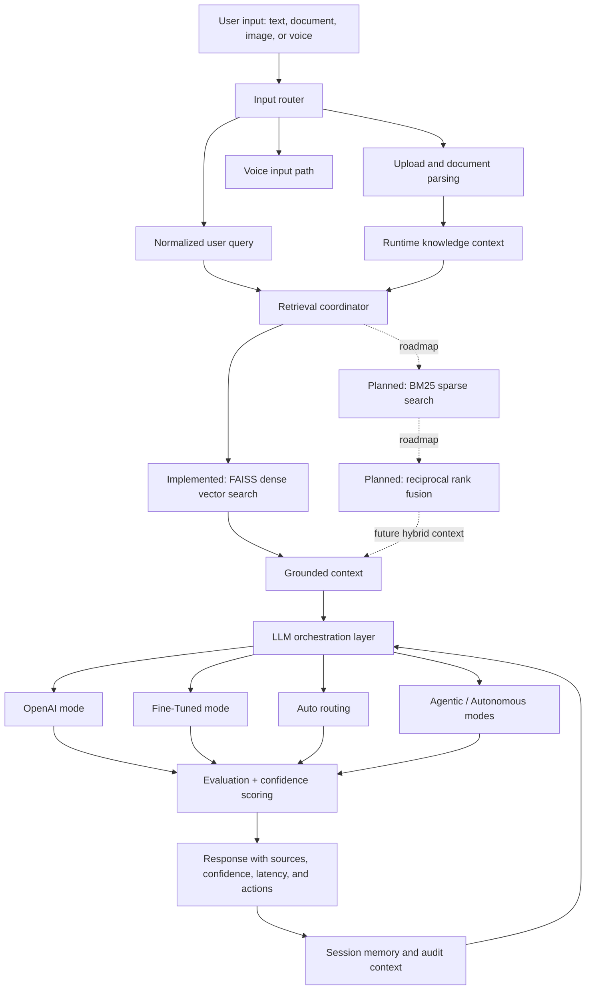

# Banking & Finance AI Agent


**Production-grade GenAI system for grounded banking, compliance, and financial knowledge workflows.**

I built this system to answer one question: what does it take to move a GenAI product beyond a chatbot demo and into a reliable, measurable AI system?

The result is a live Banking & Finance AI Agent with retrieval, model routing, domain adaptation, conversational memory work, evaluation packs, multilingual UX, upload workflows, voice support, and an autonomy audit. It is intentionally positioned as an AI agent and grounded GenAI platform, not AGI and not an overclaimed fully autonomous production system.

## Live Links

| Asset | Link |
|---|---|
| Live app | [Hugging Face Space](https://huggingface.co/spaces/RakeshMadasani/banking-finance-rag) |
| GitHub repository | [banking-genai-portfolio](https://github.com/rakeshmadasaniai/banking-genai-portfolio) |
| Fine-tuned model | [banking-finance-mistral-qlora](https://huggingface.co/RakeshMadasani/banking-finance-mistral-qlora) |
| Dataset | [banking-finance-qa-dataset](https://huggingface.co/datasets/RakeshMadasani/banking-finance-qa-dataset) |

## What This System Does

- Answers banking, finance, AML, KYC, FDIC, Basel III, RBI, and compliance questions with retrieved context.
- Supports OpenAI, Fine-Tuned, Auto, Agentic Workspace, and Autonomous Max paths where configured.
- Renders source-grounded answer cards with latency, confidence, retrieved chunks, source cards, copy/export actions, and read-aloud controls.
- Accepts text, document uploads, image-supported workflows, multilingual prompts, and voice input/output paths.
- Includes a published BankingQA-3K dataset and a QLoRA Mistral-7B adapter for domain model adaptation.
- Ships repeatable evaluation packs, committed result snapshots, and an autonomy evaluation note instead of only screenshots.

## Architecture Overview


```mermaid
flowchart TD
    U["User input: text, document, image, or voice"] --> IR["Input router"]
    IR --> UP["Upload and document parsing"]
    IR --> VI["Voice input path"]
    IR --> Q["Normalized user query"]

    UP --> KB["Runtime knowledge context"]
    Q --> RC["Retrieval coordinator"]
    KB --> RC

    RC --> FAISS["Implemented: FAISS dense vector search"]
    RC -. "roadmap" .-> BM25["Planned: BM25 sparse search"]
    BM25 -. "roadmap" .-> RRF["Planned: reciprocal rank fusion"]
    FAISS --> GC["Grounded context"]
    RRF -. "future hybrid context" .-> GC

    GC --> ORCH["LLM orchestration layer"]
    ORCH --> OAI["OpenAI mode"]
    ORCH --> FT["Fine-Tuned mode"]
    ORCH --> AUTO["Auto routing"]
    ORCH --> AGENT["Agentic / Autonomous modes"]

    OAI --> EVAL["Evaluation + confidence scoring"]
    FT --> EVAL
    AUTO --> EVAL
    AGENT --> EVAL

    EVAL --> RESP["Response with sources, confidence, latency, and actions"]
    RESP --> MEM["Session memory and audit context"]
    MEM --> ORCH
```

## System Design

The system is built in four layers:

| Layer | Runtime area | Purpose |
|---|---|---|
| AI agent runtime | `01-rag-system` | Live Streamlit product, retrieval, orchestration, source-grounded UI, uploads, voice, and agent paths. |
| BankingQA dataset | `02-qa-dataset` | 3,002-pair instruction dataset covering banking, compliance, AML, KYC, Basel III, FDIC, RBI, and finance topics. |
| Domain model adaptation | `03-qlora-finetuning` | QLoRA workflow for adapting Mistral-7B-Instruct-v0.3 to banking and financial compliance terminology. |
| Memory and orchestration | `04-conversational-memory` | FastAPI memory backend with session handling, history management, summarization, and backend comparison. |

The current live Space keeps the original folder path `01-rag-system` so existing Hugging Face deployment URLs and `app_file` metadata continue to work. Documentation now positions that folder as the AI agent runtime while preserving compatibility.

## Evaluation Metrics

These numbers are from committed project files and should be read as traceable project evidence, not marketing claims.

| Metric | Result |
|---|---|
| Evaluation prompts | 240 total prompts across domain and multilingual packs |
| Latest available evaluated rows | 160 rows across committed domain and multilingual snapshots |
| Domain pack average latency | 2037.0 ms |
| Multilingual pack average latency | 2031.8 ms |
| Dataset size | 3,002 QA pairs |
| Fine-tuning method | Mistral-7B QLoRA |
| Final train loss | 1.13 |
| Current retrieval implementation | FAISS dense vector retrieval |
| Sparse retrieval / RRF | Roadmap item, not claimed as live implementation |

For the current autonomy positioning, see [`AUTONOMY_EVALUATION.md`](AUTONOMY_EVALUATION.md). For the generated portfolio report, see [`01-rag-system/evaluation/reports/latest_portfolio_report.md`](01-rag-system/evaluation/reports/latest_portfolio_report.md).

## Key Capabilities

### Grounded Banking Answers

The runtime retrieves banking material before generation, then presents answers with source cards, confidence labels, latency, and chunk metadata.

### Model Orchestration

OpenAI mode provides a stable general path, Fine-Tuned mode connects the domain adapter path where hosted inference is configured, and Auto mode scores candidate answers based on groundedness, completeness, and latency.

### Agentic Runtime Work

The repo includes agentic/autonomous runtime work with tool-style execution traces and autonomy evaluation. This is presented honestly as a tool-calling AI system and agentic workflow layer, not as AGI.

### Domain Data and Model Adaptation

The dataset and QLoRA adapter show the system is not only prompt engineering. It includes a reusable data asset and a domain-adapted model artifact.

### Memory and API Layer

The FastAPI memory backend demonstrates session-aware conversation handling, summarization/truncation, health checks, and backend comparison endpoints.

## Demo Workflow

1. Open the [live Space](https://huggingface.co/spaces/RakeshMadasani/banking-finance-rag).
2. Ask a banking or compliance question such as `What are the main KYC requirements for banks?`.
3. Switch modes to compare OpenAI, Fine-Tuned, Auto, and agentic paths where configured.
4. Upload a PDF, DOCX, or TXT document and ask a document-grounded question.
5. Inspect confidence, source cards, latency, retrieved chunks, and read-aloud output.
6. Review evaluation artifacts under `01-rag-system/evaluation`.

## Repository Structure

```text
banking-genai-portfolio/
|-- README.md
|-- ROADMAP.md
|-- EVALUATION.md
|-- SYSTEM_DESIGN.md
|-- CONTRIBUTING.md
|-- AUTONOMY_EVALUATION.md
|-- 01-rag-system/                 # AI agent runtime and live Streamlit app
|-- 02-qa-dataset/                 # BankingQA-3K dataset build/publish workflow
|-- 03-qlora-finetuning/           # Mistral-7B QLoRA adaptation workflow
`-- 04-conversational-memory/      # FastAPI memory and orchestration backend
```

## Run Locally

```bash
git clone https://github.com/rakeshmadasaniai/banking-genai-portfolio.git
cd banking-genai-portfolio
python -m venv .venv
.venv\Scripts\Activate.ps1
pip install -r 01-rag-system/requirements.txt
copy .env.example .env
streamlit run 01-rag-system/app.py
```

Minimum environment:

```env
OPENAI_API_KEY=
HF_TOKEN=
MODEL_MODE=OpenAI
TOP_K=4
TEMPERATURE=0.2
```

## Known Limitations

- The live retrieval path is FAISS dense search; BM25 and reciprocal rank fusion are documented as roadmap work until implemented in code.
- Fine-Tuned mode depends on an available hosted endpoint or compatible local inference environment.
- Streamlit session state is not durable across browser restarts; the separate FastAPI memory backend demonstrates the production direction.
- The system is educational and portfolio-grade; it is not legal, financial, investment, or compliance advice.

## Roadmap

See [`ROADMAP.md`](ROADMAP.md) for the planned reliability, agentic architecture, governance, and production-hardening phases.

## License and Contact

This repository is intended as an AI engineering portfolio and educational system. For questions, reach out through [GitHub](https://github.com/rakeshmadasaniai), [Hugging Face](https://huggingface.co/RakeshMadasani), or [LinkedIn](https://www.linkedin.com/in/rakesh-madasani-b217b71b0/).
