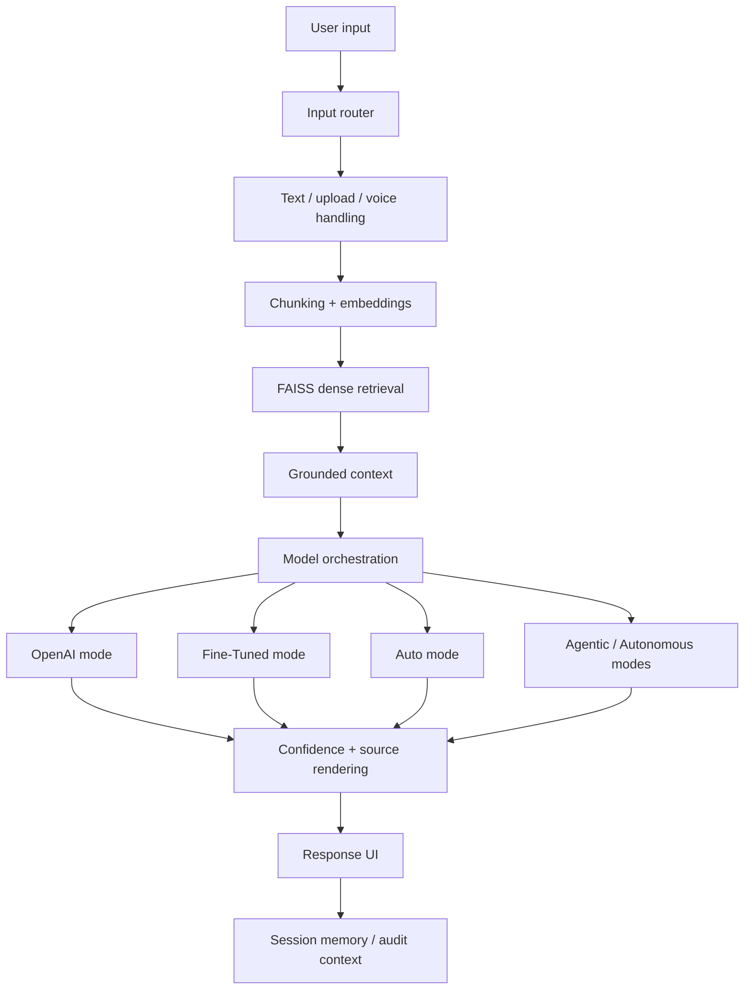

# System Design

## Problem

Banking and finance users need answers that are clear, grounded, and measurable. A normal chatbot can produce fluent text, but regulated domains require source visibility, confidence signals, evaluation, and careful handling of user-specific finance or compliance scenarios.

## Goals

- Provide a live AI workflow interface for banking and compliance questions.
- Ground answers in curated banking material and uploaded documents.
- Support multiple model paths and routing decisions.
- Track latency, confidence, source usage, and evaluation outputs.
- Demonstrate the full system chain: data, retrieval, fine-tuning, memory, evaluation, and deployment.

## Non-Goals

- Do not claim AGI.
- Do not claim formal legal, investment, financial, or compliance advice.
- Do not claim BM25/RRF as implemented until the code path exists.
- Do not claim fully autonomous production operation without durable planning, monitoring, governance, and external action controls.

## Architecture

## Retrieval Design

Current implementation:

- Documents are chunked and embedded.
- FAISS provides dense vector search.
- Retrieved context is passed into answer generation and source cards.

Planned retrieval hardening:

- Add BM25 sparse retrieval for exact regulatory terms.
- Fuse dense and sparse results with reciprocal rank fusion.
- Add retrieval evaluation comparing dense-only and hybrid retrieval.

## Model Orchestration

The runtime supports several paths:

- OpenAI mode for stable general-purpose answers.
- Fine-Tuned mode for the banking-domain adapter path.
- Auto mode for scoring candidate answers and selecting a winner.
- Agentic/autonomous modes for tool-style workflows and execution traces where configured.

Candidate scoring uses groundedness, completeness, and latency signals. This makes routing inspectable instead of hidden.

## Memory Design

The live Streamlit runtime uses session state for chat/session continuity during a browser session. The separate FastAPI memory backend demonstrates the production direction:

- session IDs,
- retained recent turns,
- summarization/truncation,
- comparison endpoints,
- health checks.

Production memory should move to durable storage such as Redis or Postgres.

## Evaluation Design

Evaluation is repository-native:

- domain prompt packs,
- multilingual prompt packs,
- runner scripts,
- summarizer scripts,
- committed CSV/JSON outputs,
- generated portfolio report,
- autonomy audit.

This structure lets reviewers inspect prompts and outputs rather than relying on hand-picked examples.

## Reliability Considerations

- Weak retrieval should be surfaced clearly.
- Mode failures should degrade gracefully.
- Fine-Tuned endpoint unavailability should not crash the app.
- Upload parsing should handle unsupported or malformed files safely.
- Agentic workflows need max-step limits, retry budgets, and stop conditions.
- Regulated finance answers should include disclaimers and avoid unsupported personalized advice.

## Tradeoffs

- Streamlit is excellent for fast product iteration, but not a full production backend by itself.
- FAISS dense retrieval is simple and fast, but sparse retrieval is needed for exact regulatory threshold matching.
- QLoRA adapters are efficient for domain adaptation, but inference still requires a compatible base model environment.
- Agentic behavior improves complex workflows, but it adds latency and requires strict controls.

## Future Improvements

- Implement BM25 + reciprocal rank fusion.
- Add durable memory and audit logs.
- Add Docker and CI/CD.
- Add p95/p99 latency monitoring.
- Add benchmarked document-upload and voice tests.
- Add governance guardrails for high-risk compliance and investment scenarios.
